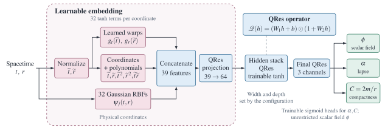
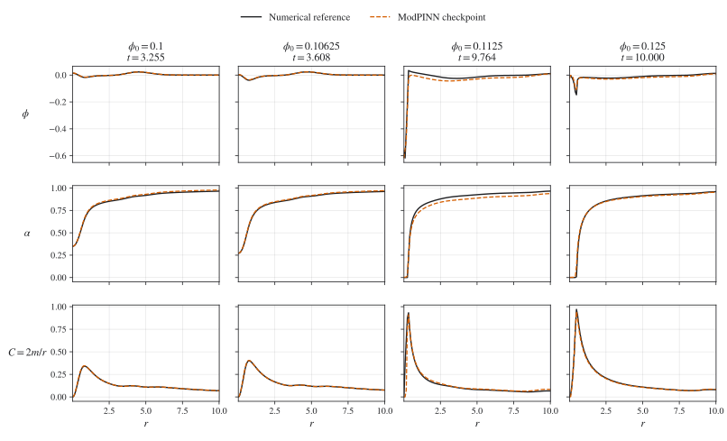

# ModPINN for spherical scalar-field collapse

This repository provides the proposed ModPINN from
[Addressing the gravitational collapse of a massless scalar field with physics-informed neural networks](https://doi.org/10.1088/2632-2153/ae5459),
*Machine Learning: Science and Technology* **7**, 025038 (2026).
The model approximates the scalar field, lapse, and compactness in the
spherically symmetric Einstein–massless-Klein–Gordon system. Its training
objective combines the field equations with initial and boundary conditions,
causal weighting, and adaptive radial sampling.

## ModPINN architecture

<picture>
  <source media="(prefers-color-scheme: dark)" srcset="datasets/figures/architecture/modpinn-dark.svg">
  <source media="(prefers-color-scheme: light)" srcset="datasets/figures/architecture/modpinn-light.svg">
  
</picture>

Adapted from Figure 2 of the paper to show the implemented ModPINN. Normalized
coordinates supply polynomial and learned-warp features, while Gaussian RBFs
use physical coordinates. The 39 features feed a 64-channel embedding and
quadratic residual (QRes) layers. The scalar field is unrestricted; trainable
sigmoid heads constrain lapse and compactness. The [method guide](docs/method.md)
connects these predictions to the physics loss.

## Start training

Begin with the [minimal training example](docs/quickstart.md), which gives a
short Python script, equivalent terminal commands, and the expected output.
The [basic Jupyter tutorials](docs/examples/README.md) cover
[training and checkpoint reload](docs/examples/quickstart.ipynb), then
[prediction, plots, and derivatives](docs/examples/inference.ipynb).
For full configurations, other amplitudes, and
custom settings, see the [training guide](docs/training.md).

Use Python 3.10 or later (tested with 3.10.20). The
[installation guide](docs/installation.md) lists the packages and environment
setup. From the repository root, install and run a small example:

```bash
python -m pip install -r requirements.txt
modpinn train --experiment best/amplitude-0.1 --smoke --output datasets/runs/example
modpinn evaluate datasets/runs/example/model.pt
```

The example performs three optimizer updates and saves its configuration,
weights, training history, and final evaluation. It checks the complete training
and reload workflow. Use the full configuration for convergence studies.
Each run needs a new output directory. Numerical references and example weights
are included, so training and evaluation need no external data download.

The [method guide](docs/method.md) specifies the residuals, network architecture,
and sampling procedure. The [inference guide](docs/inference.md) explains how
to evaluate saved models, and the [data guide](docs/reference-data.md) describes
the numerical reference arrays and their provenance.

## Spacetime fields

<picture>
  <source media="(prefers-color-scheme: dark)" srcset="datasets/figures/spacetime-dark.svg">
  <source media="(prefers-color-scheme: light)" srcset="datasets/figures/spacetime-light.svg">
  
</picture>

Scalar field, lapse, and compactness (rows) for four initial amplitudes
(columns). Colors show ModPINN predictions and white curves mark selected
contours of the numerical reference. Time is vertical and radius is horizontal,
both on linear axes. The concentration of
compactness and suppression of the lapse are visible in the two larger-amplitude
cases. Color scales are shared within each row.

## Radial profiles

<picture>
  <source media="(prefers-color-scheme: dark)" srcset="datasets/figures/profiles-dark.svg">
  <source media="(prefers-color-scheme: light)" srcset="datasets/figures/profiles-light.svg">
  
</picture>

Solid curves show the numerical reference and dashed curves show ModPINN at
the reference time of maximum compactness in each case. These comparisons use
four selected checkpoints. [Evaluation definitions and checkpoint results](docs/results.md)
give the quantitative comparison and its scope.

## Repository contents

| Directory | Contents |
| --- | --- |
| [src/](src/) | ModPINN, physics loss, training, evaluation, and supporting scripts |
| [datasets/](datasets/) | Experiment settings, numerical references, four checkpoints, and figures |
| [docs/](docs/) | Minimal examples, training and inference guides, and scientific documentation |
| [tests/](tests/) | Numerical and workflow regression tests |
| [summary/](summary/README.md) | Verification guide and repository map |

The catalogue contains 249 ModPINN training configurations. Complete training
runs use the saved epoch budgets and require substantially more work than the
short example. Their convergence is separate from checkpoint evaluation.
Generated training outputs belong in `datasets/runs/` and are ignored by Git.

The software is [MIT licensed](LICENSE). Numerical assets retain their
[citation-based terms](datasets/LICENSE.txt).
